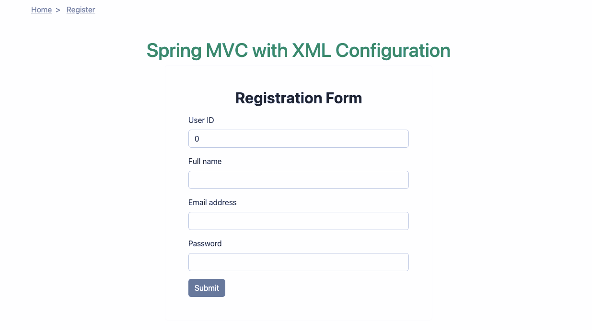

# Spring MVC Application using xml config

**Project Structure**:

```
spring-mvc-xml
.
├── pom.xml                           # Project Object Model file for Maven configuration
├── readme.md                         # Project documentation file
├── src
│     └── main
│         ├── java
│         │     └── com
│         │         └── example
│         │             ├── controller
│         │             │     └── HomeController.java   # Controller class handling HTTP requests
│         │             ├── model
│         │             │     └── User.java             # Entity class representing a user
│         │             ├── repository
│         │             │     └── UserRepository.java   # Interface for CRUD operations on User entities
│         │             └── service
│         │                 └── UserService.java        # Service class containing business logic
│         ├── resources
│         │     ├── logback.xml         # Configuration file for logging framework
│         │     ├── static
│         │     │     └── index.html    # Static HTML file
│         │     └── templates           # Folder for Thymeleaf templates or other view templates
│         └── webapp
│             ├── WEB-INF
│             │     ├── dispatcher-servlet.xml          # Spring MVC configuration file
│             │     ├── lib
│             │     │     ├── jakarta.servlet.jsp.jstl-api-3.0.0         # JSTL API for JSP support
│             │     │     └── jakarta.servlet.jsp.jstl-api-3.0.0.jar     # JSTL API jar file
│             │     ├── views
│             │     │     ├── practice.jsp              # JSP view for practice page
│             │     │     ├── signup.jsp                # JSP view for signup page
│             │     │     └── spinner.jsp               # JSP view for loading spinner
│             │     └── web.xml                         # Deployment descriptor for the web application
│             ├── breadcrumb.jsp       # JSP fragment for breadcrumb navigation
│             └── index.jsp            # Main JSP view for the index page
└── target/
    ├── classes/                    # Compiled Java classes
    │   .
    │   .
    │   └── views/                  # Compiled JSP views
    └── spring-mvc-xml.war          # Deployable WAR file
```

### Maven Dependencies for Spring MVC Application

- **Spring Core (`spring-core`, `spring-context`)**: These are the core components of the Spring framework providing the
  fundamental features, including IoC and Dependency Injection.
- **Spring Web (`spring-web`, `spring-webmvc`)**: These modules are required for building web applications, providing
  the Spring MVC framework, and web-related functionality.
- **Servlet API (`javax.servlet-api`)**: Required for developing web applications. It defines the HTTP protocol support.
- **JSP API (`javax.servlet.jsp-api`)**: Required if you are using JSP as your view technology.
- **JSTL (`javax.servlet:jstl`)**: Provides a set of common tags for JSP.
- **Spring ORM (`spring-orm`)**: Required if using ORM tools like Hibernate with Spring.
- **Hibernate (`hibernate-core`)**: Required if using Hibernate as the ORM tool.
- **JDBC (`spring-jdbc`)**: Provides support for JDBC operations in Spring.
- **Logging (`slf4j-api`, `logback-classic`)**: Provides logging capabilities.


### Screenshots



### Setting Up the Application

1. **Configure the DispatcherServlet**: Define the `DispatcherServlet` in your `web.xml`.

   ```xml
       <!DOCTYPE web-app PUBLIC
       "-//Sun Microsystems, Inc.//DTD Web Application 2.3//EN"
       "http://java.sun.com/dtd/web-app_2_3.dtd" >

       <web-app>
         <display-name>Archetype Created Web Application</display-name>
         <servlet>
           <servlet-name>dispatcher</servlet-name>
           <servlet-class>org.springframework.web.servlet.DispatcherServlet</servlet-class>
           <init-param>
             <param-name>contextConfigLocation</param-name>
             <param-value>/WEB-INF/dispatcher-servlet.xml</param-value> <!-- Path to your Spring MVC configuration XML -->
           </init-param>
           <load-on-startup>1</load-on-startup>
         </servlet>
         <servlet-mapping>
           <servlet-name>dispatcher</servlet-name>
           <url-pattern>/</url-pattern>
         </servlet-mapping>
       </web-app>
   ```

   This file is a deployment descriptor for a web application in Java, commonly known as `web.xml`. It is used to
   configure various settings and components of the web application, such as servlets, filters, listeners, and welcome
   pages. Let's break down the contents of this `web.xml` file:

   1. **DOCTYPE Declaration**:

      - This line declares the Document Type Definition (DTD) for the XML document. It specifies the DTD version and
        the public identifier. In this case, it references the DTD for web applications version 2.3 provided by Sun
        Microsystems.

   2. **`<web-app>` Element**:

      - This is the root element of the `web.xml` file, representing the configuration of the entire web application.
      - It contains various child elements for configuring servlets, filters, listeners, context parameters, error
        pages, etc.

   3. **`<display-name>` Element**:

      - This element specifies the display name of the web application, which is used for identification purposes.
      - The value "Archetype Created Web Application" is just a placeholder and can be customized to provide a more
        meaningful name for the application.

   4. **Servlet Configuration**:

      - The `<servlet>` element is used to configure a servlet within the web application.
      - `<servlet-name>` specifies a unique name for the servlet. In this case, it is named "dispatcher".
      - `<servlet-class>` specifies the fully qualified class name of the servlet implementation. Here, it points to
        the Spring MVC `DispatcherServlet`.
      - `<load-on-startup>` indicates that the servlet should be loaded and initialized when the application starts.
        The value "1" specifies the load order, with lower values indicating earlier loading.

   5. **Servlet Mapping**:
      - The `<servlet-mapping>` element maps a servlet to a URL pattern.
      - `<servlet-name>` refers to the name of the servlet defined earlier ("dispatcher").
      - `<url-pattern>` specifies the URL pattern that requests should match in order to be handled by the servlet. In
        this case, the URL pattern is "/", indicating that the servlet will handle requests for all URLs.

2. **Spring Configuration File**: Define a Spring configuration file to set up component scanning and view resolver.

   ```xml
   <?xml version="1.0" encoding="UTF-8"?>
   <beans xmlns="http://www.springframework.org/schema/beans"
          xmlns:xsi="http://www.w3.org/2001/XMLSchema-instance"
          xmlns:context="http://www.springframework.org/schema/context"
          xmlns:mvc="http://www.springframework.org/schema/mvc"
          xsi:schemaLocation="http://www.springframework.org/schema/beans http://www.springframework.org/schema/beans/spring-beans.xsd
              http://www.springframework.org/schema/context https://www.springframework.org/schema/context/spring-context.xsd
              http://www.springframework.org/schema/mvc https://www.springframework.org/schema/mvc/spring-mvc.xsd">

     <!-- Enable annotation-driven MVC -->
     <mvc:annotation-driven/>

     <!-- View Resolver -->
     <bean id="viewResolver" class="org.springframework.web.servlet.view.InternalResourceViewResolver">
       <property name="viewClass" value="org.springframework.web.servlet.view.JstlView"/>
       <property name="prefix" value="/WEB-INF/views/"/>
       <property name="suffix" value=".jsp"/>
     </bean>

     <!-- Component Scan -->
     <context:component-scan base-package="com.example"/>
   </beans>
   ```

3. **Controller Example**:

   ```java
   package com.example.controller;

   import org.springframework.stereotype.Controller;
   import org.springframework.ui.Model;
   import org.springframework.web.bind.annotation.GetMapping;

   @Controller
   public class HomeController {
       @GetMapping("/home")
       public String home(Model model) {
           model.addAttribute("message", "Hello, Spring MVC!");
           return "home";
       }
   }
   ```

4. **JSP View**:

   ```html
   <!-- src/main/webapp/WEB-INF/views/registerForm.jsp -->
   <!DOCTYPE html>
   <html>
     <head>
       <title>Home</title>
     </head>
     <body>
       <h1>${message}</h1>
     </body>
   </html>
   ```

By including these dependencies and following the configuration steps, you can set up a basic Spring MVC application
without using Spring Boot.
