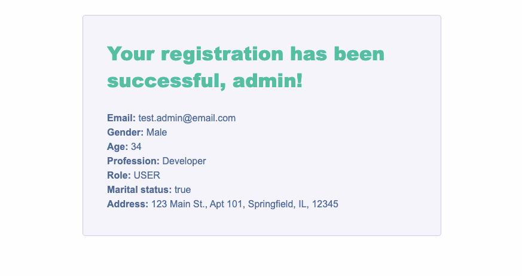

# Spring MVC Application

**Project Overview**

This project is a web application built using Spring MVC with Java configuration. It includes complex form handling, data persistence using Hibernate and MySQL, and view rendering with Thymeleaf. The application demonstrates the integration of various technologies, providing a comprehensive example of a modern web application using Spring's ecosystem.

### 1. Project Setup

**Directory Structure**
```
spring-mvc/
.
├── mvnw
├── mvnw.cmd
├── pom.xml
├── readme.md
├── spring-mvc.iml
├── src
│   ├── main
│   │   ├── java
│   │   │   └── com
│   │   │       └── example
│   │   │           └── springmvc
│   │   │               ├── configs
│   │   │               │   ├── PersistenceConfig.java
│   │   │               │   ├── WebApplicationInitializer.java
│   │   │               │   └── WebConfig.java
│   │   │               ├── controller
│   │   │               │   ├── FormController.java
│   │   │               │   ├── HomeController.java
│   │   │               │   └── UserController.java
│   │   │               ├── model
│   │   │               │   ├── Address.java
│   │   │               │   └── User.java
│   │   │               ├── repository
│   │   │               │   ├── UserDAO.java
│   │   │               │   └── UserDAOImpl.java
│   │   │               └── service
│   │   │                   └── UserService.java
│   │   ├── resources
│   │   │   ├── logback.xml
│   │   │   └── static
│   │   │       └── styles.css
│   │   └── webapp
│   │       └── WEB-INF
│   │           ├── templates
│   │           │   ├── address.html
│   │           │   ├── form.html
│   │           │   ├── index.html
│   │           │   └── success.html
│   │           └── views
│   └── test
│       ├── java
│       └── resources
└── target
    ├── classes
    └── spring-mvc-1.0-SNAPSHOT
        ├── META-INF
        └── WEB-INF
            ├── classes
            ├── lib
            └── views
```

### 2. Maven Dependencies for Spring MVC Application

- **Spring Core (`spring-core`, `spring-context`)**: Core components of the Spring framework, providing fundamental features like IoC and Dependency Injection.
- **Spring Web (`spring-web`, `spring-webmvc`)**: Required for building web applications, providing the Spring MVC framework, and web-related functionality.
- **Spring ORM (`spring-orm`)**: Required for using ORM tools like Hibernate with Spring.
- **Hibernate (`hibernate-core`)**: Required for using Hibernate as the ORM tool.
- **JDBC (`spring-jdbc`)**: Provides support for JDBC operations in Spring.
- **Lombok (`lombok`)**: Utility to reduce boilerplate code for model objects.
- **Thymeleaf (`thymeleaf`, `thymeleaf-spring6`)**: A template engine for rendering views in a Spring MVC application.
- **Validation (`jakarta.validation`)**: Provides support for bean validation.

### 3. Java Configuration

Create a configuration class, e.g., `WebConfig`, to replace `web.xml`.

1. **`@Configuration`**: Indicates that the class contains bean definitions processed by the Spring container at runtime.
2. **`@EnableWebMvc`**: Enables Spring MVC configuration by importing the `DelegatingWebMvcConfiguration`.
3. **`@ComponentScan`**: Tells Spring to scan for components (controllers, services, repositories, etc.) in the specified package (`com.example.springmvc`) and its sub-packages.
4. **`WebMvcConfigurer`**: Provides methods to customize the Java-based configuration for Spring MVC. Implementing this interface allows you to override its methods for custom configurations.
5. **`addResourceHandlers()`**: Registers resource handlers for serving static resources such as CSS, JavaScript, images, etc.
6. **`configureViewResolvers()`**: Configures view resolution. For example, an `InternalResourceViewResolver` resolves view names to JSP files located within the `/WEB-INF/views/` directory.

### 4. Validation

**Steps to add validation:**

1. **Add Validation Annotations**:
    - Annotate model fields with appropriate validation annotations (`@NotEmpty`, `@Size`, `@Email`, etc.) to enforce validation rules.
    - `@NotEmpty`: Ensures the field is not empty.
    - `@Size`: Specifies the acceptable length for the string.
    - `@Email`: Ensures the email is in a valid format.
    - `@Min` and `@Max`: Ensure the value of the field is within a specific range.

2. **Add `@Valid` Annotation**:
    - Annotate the model attribute parameter in the controller method with `@Valid` to trigger validation.

3. **Include `BindingResult` Parameter**:
    - Add a `BindingResult` parameter after the `@Valid` annotated model attribute to capture validation errors.

4. **Handle Validation Errors**:
    - Check if there are validation errors using `result.hasErrors()`.
    - Redirect back to the form if errors exist.
    - Add validation errors to the redirect attributes.

5. **Redirect with Success Message**:
    - If no validation errors:
        - Process the form data (e.g., save to database).
        - Add a success message to the redirect attributes.
        - Redirect to a success page or back to the form.

6. **Display Validation Error Messages**:
    - Create a `<span>` element for each input field to display validation error messages.
    - Utilize Thymeleaf's conditional rendering to display error messages only if validation errors occur.
    - Use `th:if` and `th:errors` attributes to conditionally display error messages based on validation results.

By following these steps, validation is enforced in the model, properly handled in the controller, and feedback is provided to users through the view during form submission.

### 5. Final Screenshots

<div>
   
   
</div>

### 6. Conclusion

This project provided practical experience with configuring and developing a Spring MVC application using Java configuration, handling complex forms, persisting data with Hibernate and MySQL, and utilizing Thymeleaf for view rendering. It also demonstrated the integration of various technologies and libraries such as Lombok for reducing boilerplate code.